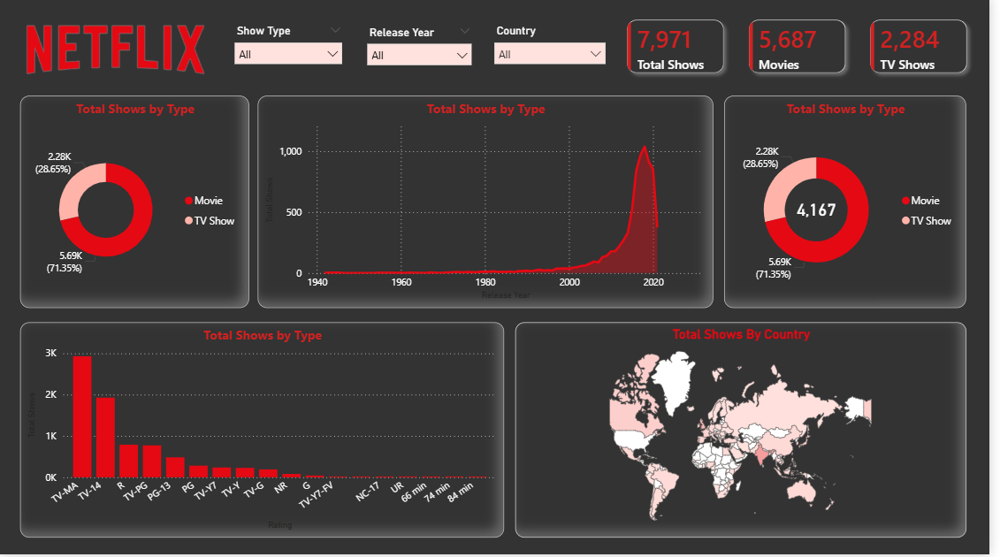

# 🎬 Netflix Dashboard using Power BI

## 📌 Project Overview
This project is an interactive Netflix Dashboard created using Power BI to analyze Netflix movies and TV shows data.

The dashboard provides meaningful insights into:
- Total Movies & TV Shows
- Genre Distribution
- Ratings Analysis
- Release Year Trends
- Country-wise Content
- Content Type Comparison

---

## 🚀 Tools & Technologies
- Power BI
- Excel / CSV
- Data Visualization
- Data Cleaning

---

## 📂 Dataset Information
The dataset contains Netflix content details such as:
- Title
- Genre
- Country
- Release Year
- Rating
- Duration
- Type (Movie/TV Show)

---

## ✨ Dashboard Features
✔ Interactive Filters  
✔ KPI Cards  
✔ Trend Analysis  
✔ Visual Reports  
✔ User-Friendly Interface  

---

## 📸 Dashboard Preview

---

## 📁 Project Files

| File Name | Description |
|------------|-------------|
| project.pbix | Power BI Dashboard File |
| netflix_titles(1).csv | Dataset File |
| Screenshot.png | Dashboard Screenshot |
| README.md | Project Documentation |

---

## ▶ How to Use
1. Download the `.pbix` file
2. Open in Power BI Desktop
3. Explore the dashboard visuals and insights

---

## 📈 Key Insights
- Most content on Netflix consists of Movies
- Drama and Comedy are dominant genres
- Content growth increased rapidly after 2015
- The United States has the highest content distribution

---

## 👩‍💻 Author
**Anu**

- GitHub: https://github.com/pillianu

---

## ⭐ If you like this project
Give this repository a ⭐ on GitHub!
